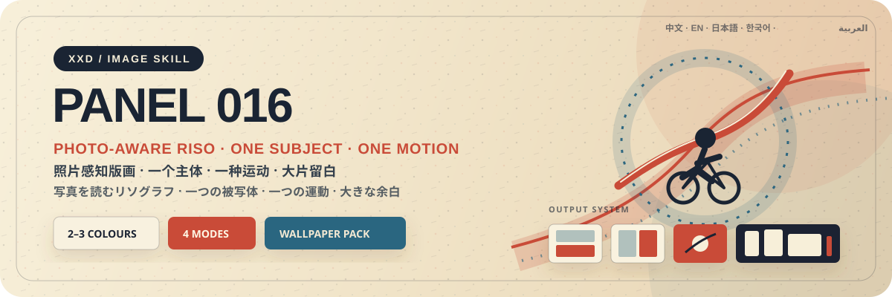
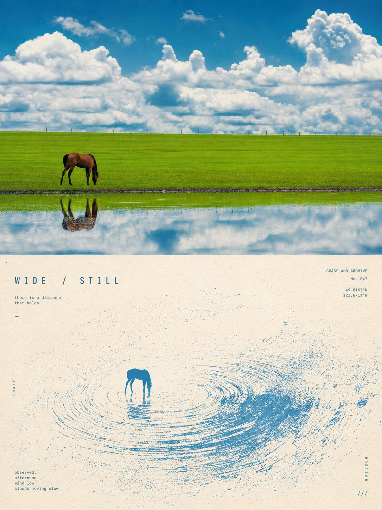
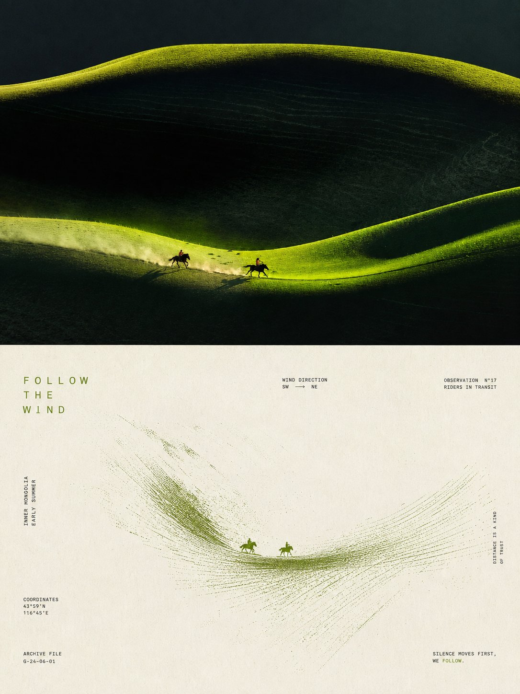
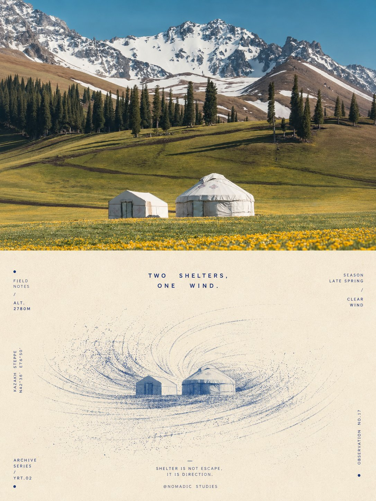
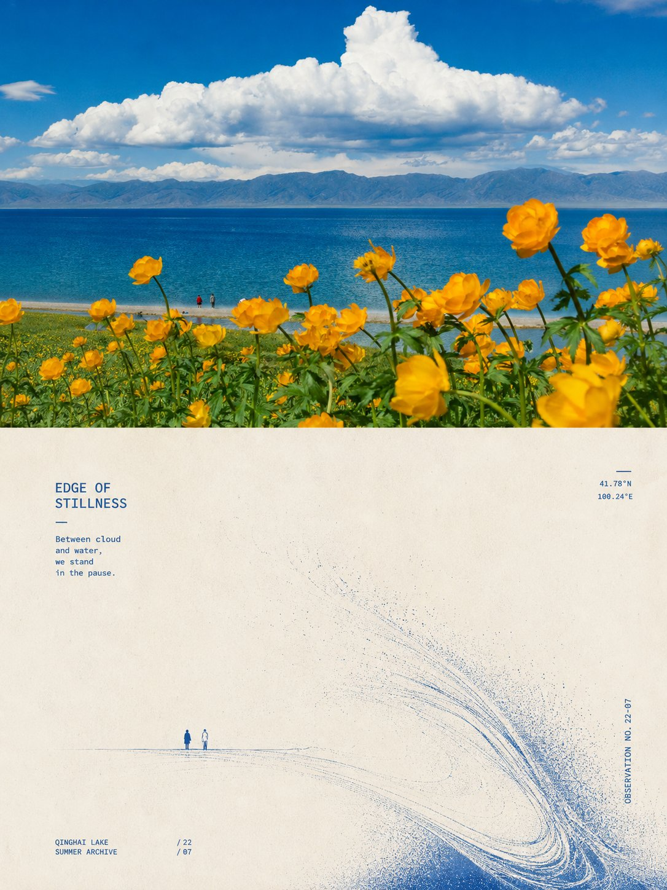
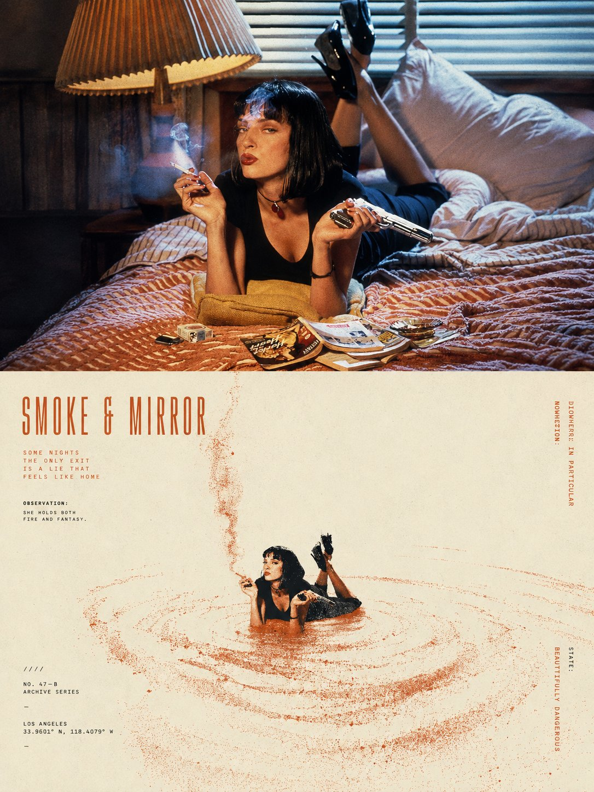
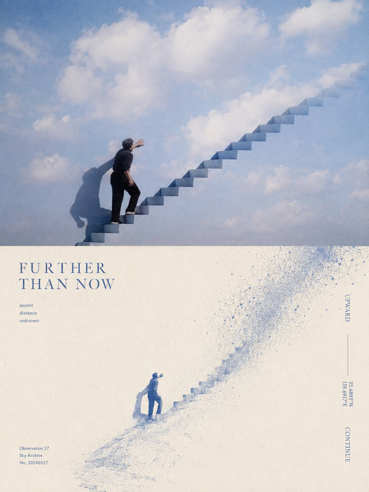
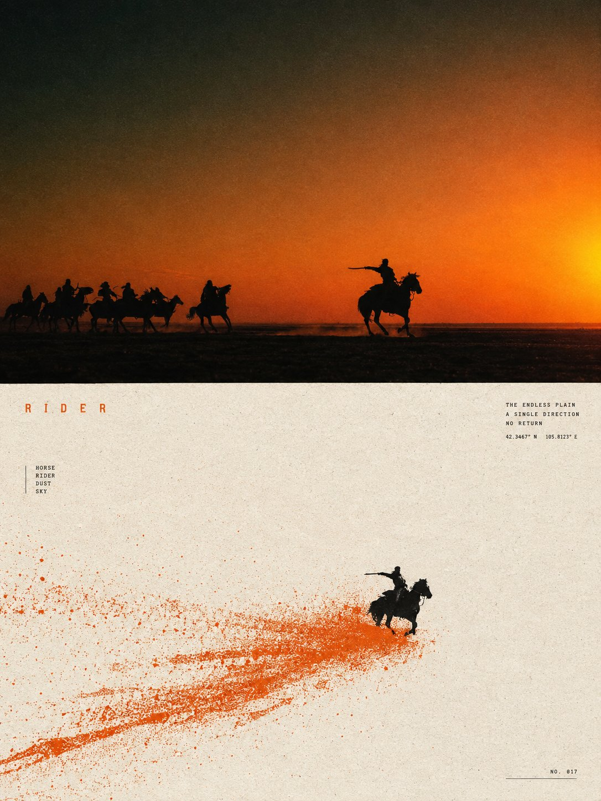
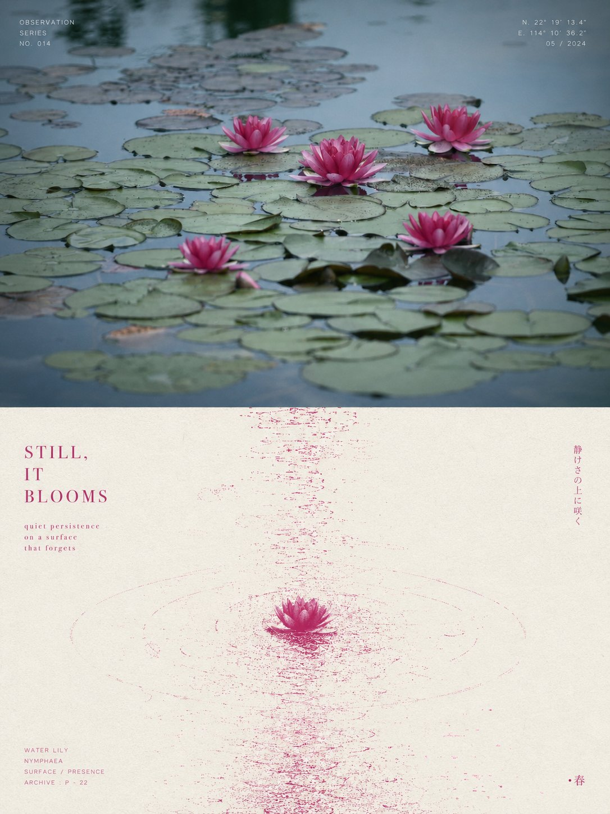

<p align="center">
  
</p>

<div align="center">

# XXD Panel 016

### Compress what truly happens in a photograph into one anchor and one field of motion

[](./SKILL.md)
[](#four-outputs-not-four-templates)
[](#boundaries-and-trust)

<a href="README.md">简体中文</a> · <strong>English</strong> · <a href="README.ja.md">日本語</a> · <a href="README.ko.md">한국어</a> · <a href="README.ar.md">العربية</a>

</div>

> ONE SUBJECT · ONE MOTION · A LARGE FIELD OF AIR

XXD Panel 016 is an image-generation skill for Codex and compatible agents. It does not place a photograph under a fixed filter. It reads the subject, posture, direction, light, distance, and unfinished relationship, then compresses that evidence into a restrained, tactile Riso or screen-printed composition.

The photograph supplies the facts. 016 decides which motion deserves to remain.

## Why it exists

Generic style transfer often makes unrelated photographs look like the same decorative poster. A real subject becomes a stock sun, wave, ring, or geometric icon; the palette stops belonging to the source; the title could be reused on any image.

016 works in the opposite direction. It locks one small but recognisable visual anchor, then derives exactly one motion logic from posture, light, or spatial relation. The result may be minimal, but it must retain evidence that could only have come from this photograph.

```text
source photo → lock visual facts → read relation and subtext → choose one motion → generate print → compose and inspect
```

## The 016 visual contract

- **One anchor:** a small recognisable core, with no competing second subject.
- **One motion:** falling, rising, flowing, radiating, or ripple/echo—never a stack of effects.
- **Active void:** normally 60%–78% open paper, so stillness and movement can coexist.
- **Source-derived colour:** one dominant source colour, warm paper, and optional black; 2–3 colours in total.
- **Physical print character:** halftone, fibre, dry ink, grain, and slight misregistration act as structure rather than decoration.
- **Type as space:** title and microcopy follow motion, axes, and void instead of sitting inside an advertising box.

## Samples · from X

> [Xiaoxiaodong (@xiaoxiaodong01)](https://x.com/xiaoxiaodong01/status/2090127008349163643) · 19 August 2026<br>
> GPT2 × grain × magnetic field × printmaking × aesthetic prompt × VOL.016<br>
> Images originally sourced from *Chinese National Geography* · Xinjiang

<table>
  <tr>
    <td width="50%"><a href="https://x.com/xiaoxiaodong01/status/2090127008349163643"></a></td>
    <td width="50%"><a href="https://x.com/xiaoxiaodong01/status/2090127008349163643"></a></td>
  </tr>
  <tr>
    <td width="50%"><a href="https://x.com/xiaoxiaodong01/status/2090127008349163643"></a></td>
    <td width="50%"><a href="https://x.com/xiaoxiaodong01/status/2090127008349163643"></a></td>
  </tr>
</table>

<p align="center"><a href="https://x.com/xiaoxiaodong01/status/2090127008349163643">View the original post and full notes →</a></p>

### More 016 variations · philosophy and magnetic fields

> [Xiaoxiaodong (@xiaoxiaodong01)](https://x.com/xiaoxiaodong01/status/2090727539052302568) · 21 August 2026<br>
> GPT2 × philosophy × magnetic field × aesthetic prompt × VOL.016 supplement<br>
> The same principle—one subject, one motion, one vast spatial relation—can produce entirely different fields and emotional registers across photographs.

<table>
  <tr>
    <td width="50%"><a href="https://x.com/xiaoxiaodong01/status/2090727539052302568"></a></td>
    <td width="50%"><a href="https://x.com/xiaoxiaodong01/status/2090727539052302568"></a></td>
  </tr>
  <tr>
    <td width="50%"><a href="https://x.com/xiaoxiaodong01/status/2090727539052302568"></a></td>
    <td width="50%"><a href="https://x.com/xiaoxiaodong01/status/2090727539052302568"></a></td>
  </tr>
</table>

<p align="center"><a href="https://x.com/xiaoxiaodong01/status/2090727539052302568">View the supplementary post and English prompt →</a></p>

These samples demonstrate the adaptability and aesthetic motive of 016; they do not turn the post's earlier canvas into a current default. The modes still follow the explicit pre-generation canvas and custom sizing logic below.

## The original brief is authoritative

`references/016-source.md` is this project's sole creative and aesthetic authority. The Skill no longer summarizes or expands it, and it does not impose a shared palette, colour plan, aesthetic motive, title, or microcopy package. GPT Image 2 follows that brief's own rules for colour, material, composition, whitespace, wording, and typography.

Mode and size completely replace the legacy 3:4 top-bottom delivery container without rewriting the transformation aesthetic. Each asset sends GPT Image 2 one selected mode's final contract instead of asking it to interpret four alternatives inside a generic template.

## Four combinable output modes

Select one or more of `top-bottom`, `left-right`, `design-only`, and `wallpaper-pack`. When several are selected, each is generated independently with its own prompt.

- `top-bottom`: one complete canvas with the reality view above and transformed design below.
- `left-right`: one complete canvas whose left-right structure runs from top edge to bottom edge, source left and design right. Typography stays inside that structure rather than creating a shared third footer; widths may be asymmetric.
- `design-only`: the source is a non-visible reference for identity, structure, colour logic, and facts; every visible element follows this Panel's transformation language.
- `wallpaper-pack`: each device receives an independently composed full-canvas transformed wallpaper, with no source-photo region.

There is no seam, midpoint-percentage, or pixel-coordinate test. Deterministic assembly is used only when the user explicitly requests exact panel geometry or pixel-identical source preservation.

Ordinary sizes are also multi-select: auto-fit, source aspect, 1:1, 3:4, 4:3, 4:5, 5:4, 2:3, 3:2, 9:16, 16:9, 21:9, 5:7, 7:5, or custom ratios/exact pixels. There is no silent default. Every distinct aspect is independently recomposed from the same verbatim source brief.

Wallpaper packs may be linked or independent. A linked pack creates one anchor image, then recomposes each remaining device from the original source plus that anchor; it never crops one image into four sizes.

## Text modes

Before generation, resolve one of three choices:

1. **Model generates text from the original prompt**: the user supplies only the language or locale; GPT Image 2 follows the source brief's wording, amount, tone, and typography logic. Every word arises from the current image's content, atmosphere, or implied meaning, and anything presented as factual or documentary information must be grounded in supplied, visible, or verified facts.
2. **Use my exact text**: pass it verbatim, without rewriting, translating, or adding a title; typography still follows the source brief.
3. **No text**: prohibit visible text and pseudo-text.

The outer Skill no longer pre-writes titles, microcopy, or copy packages. Output language is resolved separately from the interface language and is never guessed from a person, scene, or filename.

## Complete-canvas first, raster-only delivery

The image model owns the aesthetics of the entire finished composition; paired layouts also default to one complete-canvas generation. `scripts/compose_panel.py` remains only for condition-based recovery, lossless pixel calibration, and read-only audit. It is not run pre-emptively and does not judge aesthetic success.

Every deliverable is a raster PNG and every invocation creates a fresh task under `~/Desktop/xxd/`. The configured image route exposes sanitised status only—never providers, endpoints, credentials, headers, prompts, responses, or account details. SVG, HTML, Canvas, diagrams, and programmatic drawing are not substitutes for the final artwork.

## Capability-adaptive questions and inline parameters

The same Skill adapts to the host's real interaction capabilities and never presents decorative symbols as clickable controls:

- **When Claude Code exposes `AskUserQuestion + multiSelect: true`**: modes and sizes use genuine checkboxes; text mode and wallpaper relationship use single-select. Common sizes are grouped into square, portrait, and landscape checkbox questions, selections accumulate across groups, and custom sizes use free input.
- **When Codex exposes only `request_user_input`**: use it only for mutually exclusive fields such as text mode and wallpaper relationship. Do not misrepresent modes or sizes as single-choice; collect them through clear combination input.
- **With no interactive question tool**: use two typed rounds—modes first, then sizes plus text. Never draw fake `- [ ]` boxes or ask the user to switch to Plan mode merely to obtain a form.

The second round initially shows only Smart recommendation, Source aspect, Common ratios, and Custom. Expand the full library only when requested: square `1:1`; portrait `3:4, 4:5, 2:3, 9:16, 5:7`; landscape `4:3, 5:4, 3:2, 16:9, 21:9, 7:5`. Any ratios may be combined, and exact pixels are always accepted.

All settings can also be passed inline:

```text
/xxd-panel-016 photo.jpg --mode top-bottom,design-only --size auto,3:4,9:16 --text prompt --locale ja-JP
```

Supported parameters are `--mode`, repeatable or comma-separated `--size`, `--text prompt|exact|none`, `--locale`, `--copy`, `--wallpaper linked|independent`, `--wallpaper-size`, and `--out`. Complete parameters skip preflight; partial parameters trigger only missing questions.

## Image-model priority

GPT Image 2 is the default first choice. It keeps this project's established workflow: high-fidelity source reference, explicit whole-canvas selection before generation, one complete-canvas generation for paired modes, and scripted composition only as a conditional fallback.

Seedance 5.0 Pro, Nano Banana Pro (Gemini Image Pro), Nano Banana 2 (Gemini Image Flash), or another compatible bitmap model may also be used when it is actually available through the current tools or configured routes and can satisfy source fidelity, whole-canvas ratio, target-language text, and linked-wallpaper multi-reference requirements. An alternative changes only the generation route; it must not change modes, canvas, copy, locale, wallpaper relationship, or the complete-canvas-first strategy.

If no suitable route is available, the Skill asks the user to enable an image-generation tool or provide an API key. User-provided credentials may be used for the current task without being echoed, displayed, logged, or exposed. They are not persisted, and provider, account, billing, or global route configuration is not modified, unless the user explicitly requests that configuration change.

## Get started

```bash
git clone https://github.com/nevertoday/xxd-panel-016.git
mkdir -p ~/.codex/skills
ln -s "$(pwd)/xxd-panel-016" ~/.codex/skills/xxd-panel-016
```

Claude Code users can link the same folder to `~/.claude/skills/xxd-panel-016`. Restart the agent session after installation.

```text
$xxd-panel-016
Turn this photograph into a 2560×1440 left-right composition. Use Japanese copy.
```

You may also invoke the skill with only a photograph. It will asks for one or more output modes in a numbered multiline menu, then ask whether a wallpaper pack should be linked or independent when necessary.

Full specifications:

- [Skill workflow](SKILL.md)
- [Chinese runtime adapter](references/xxd-panel-016-prompt.zh-CN.md)
- [English runtime adapter](references/xxd-panel-016-prompt.en.md)

## Boundaries and trust

- Each source photo stays inside its own task and never borrows subjects, old outputs, or bundled examples.
- Every invocation opens a fresh task directory; a previous result cannot be declared the current job.
- Deliverables are PNG bitmaps, never SVG, HTML, Canvas, or programmatic-vector substitutes.
- The configured bitmap bridge emits sanitised status only and does not print providers, endpoints, headers, credentials, prompts, or server response bodies.
- Each selected ordinary mode returns one file; selected `wallpaper-pack` adds four separate wallpapers. `all` returns seven PNGs per source across four sibling mode directories, never a contact sheet or overview.

Local composition needs Python 3 and Pillow. The safe bitmap bridge uses Python 3.11+ `tomllib`. Image generation still requires a host agent with built-in raster generation or an already configured compatible raster route.

## Repository

```text
xxd-panel-016/
├── SKILL.md
├── README.md / README.en.md / README.ja.md / README.ko.md / README.ar.md
├── agents/openai.yaml
├── assets/banner.svg
├── scripts/
│   ├── compose_panel.py
│   └── configured_imagegen.py
└── references/
    ├── xxd-panel-016-prompt.zh-CN.md
    ├── xxd-panel-016-prompt.en.md
    └── 016-source.md
```

## About XXD

XXD is the abbreviated brand name of Xiaoxiaodong. This project is created and maintained by [@xiaoxiaodong01](https://x.com/xiaoxiaodong01).

## Support and Membership

### In-depth Consultation · CNY 299/hour

One-to-one in-depth consultation for using the Skills is billed at CNY 299 per hour. To book a session, contact Xiaoxiaodong through the WeChat QR code below.

### Xiaoxiaodong Skills User Community · CNY 99 to join

A one-time CNY 99 fee joins the user community for sharing workflows, discussing work, and peer support. It does not include hourly one-to-one in-depth consultation. Scan the WeChat QR code below and include “Skills User Community” in your message.

### Knowledge Planet + Member Prompt Library · CNY 699/year

The Knowledge Planet community and the [XXD Member Prompt Library](https://vip.xiaoxiaodong.ai/) are one membership: **one annual payment unlocks both, with no second purchase required.**

Choose either activation route:

1. Subscribe through [Knowledge Planet](https://wx.zsxq.com/group/15554814142882), then contact Xiaoxiaodong on WeChat for a Member Prompt Library redemption code.
2. Subscribe directly through the [Member Prompt Library](https://vip.xiaoxiaodong.ai/), then contact Xiaoxiaodong on WeChat for an invitation to Knowledge Planet.

<p align="center">
  <a href="https://xiaoxiaodong.pages.dev/assets/wechat-qr.png"></a>
</p>

<div align="center">

**Understand what is truly happening in the photograph, then let the design grow from it.**

</div>

---

<div align="center">
  <h2>☕ Support this open-source project</h2>
  <p>If this project saved you time, a Star, a share, or a coffee helps keep it moving.</p>
  <table>
    <tr>
      <td align="center" width="240">
        <a href="https://github.com/nevertoday/zhongguo-traditional-colors/blob/main/docs/images/buy-me-a-coffee-qr.png?raw=true"></a><br>
        <strong>Buy me a coffee</strong><br>
        <sub>Scan or open the QR code to support Xiaoxiaodong</sub>
      </td>
    </tr>
  </table>
  <p><sub>Support is entirely optional and never changes access to this open-source project.</sub></p>
</div>
